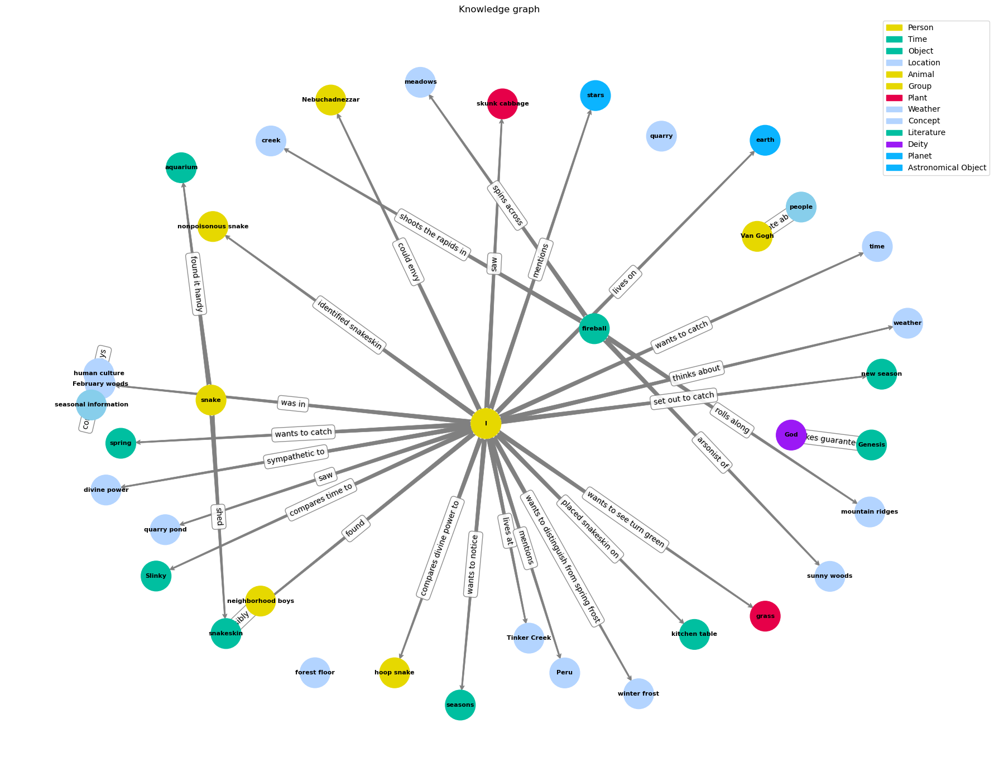
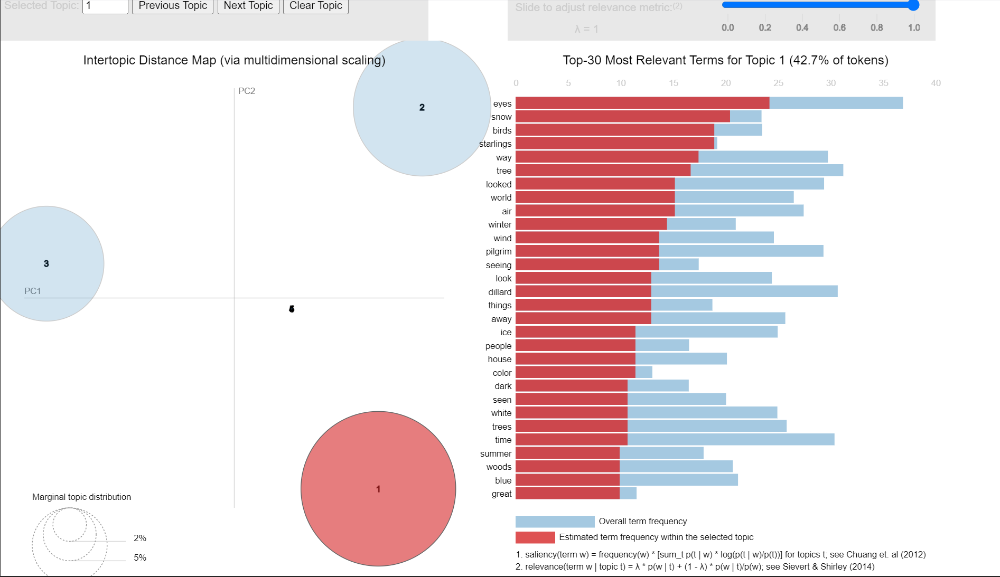

## Knowledge Graphs generated via GPT
In this python code, I generate a knowledge graph from a document. In this example, the chapter 'Knot' from Anne Dilliard's book, Pilgram at Tinker Creek is used as input. The entities and relations are generated using a gpt model. Different colours are dynamically assigned to the different types of entities.

## Topic Modeling with LDA
In this Python code, topic modeling using Latent Dirichlet Allocation (LDA) is performed to analyse a collection of text chapters. I use the Gensim library for text preprocessing, dictionary creation, and LDA model training. Six chapters from Annie Dilliard's book Pilgram at Tinker Creek is used as input as these chapters are [freely available online](file:///C:/Users/dedbl/Downloads/Annie%20Dillard%20-%20Pilgrim%20at%20Tinker%20Creek%20(pdf).pdf) in pdf form. Her autobiographical novel focuses on meditations on the natural world surrounding her. My aim here was to see if I could pull out topics related to aspects like the seasons or feelings of each chapter.

#### The main steps include:

- Loading text content from a folder of .txt files.
- Preprocessing the text data to remove stopwords and tokenize words.
- Creating a dictionary and a corpus of Bag-of-Words representations.
- Building an LDA model with specified topics and passes.
- Displaying the top words for each topic.
- Determining the dominant topic for each chapter and its probability.
- The code provides insights into the main themes present in the chapters and how they are distributed among topics. The resulting insights can be used for content analysis, topic identification, and understanding the content of the text collection.

#### Dependencies:

Python 3.x
Gensim library
pyLDAvis library for visualization (optional)

